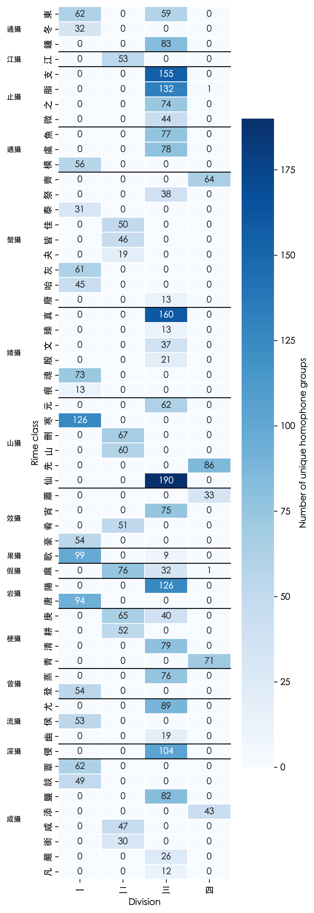

# Guangyun-Yunjing-Crossvisualization

## Question

The *Guangyun* 廣韻 (compiled 1008 CE) and the *Yunjing* 韻鏡 (compiled c. 1161 CE) are two different ways of organizing the same **Middle Chinese (MC)** phonological data. However, they fundamentally operate on different search logics. Suppose, for example, there was a late Song dynasty (960–1279 CE) scholar who was seeking rhyme data for composing poetry.

- The *Guangyun* is a rime dictionary: the organizing principle is the rime category (*yunmu* 韻目). There are 206 of them, ordered by tone (平上去入). For a Song dynasty scholar looking up a character, the process is linear: he begins from the tone (*sheng* 聲) of the character, moves onto its rime category, then scans through the homophone groups (*xiaoyun* 小韻) within that category sequentially. We may thus represent the Guangyun's implicit data structure as essentially a flat list nested one level deep: tone → rhyme category → xiaoyun → characters. The initial consonant of the character, i.e., *how* a character is being articulated is *not* part of the organizational structure at all. A 幫-initial character and a 見-initial character sit next to each other if they share the same rime.
- The *Yunjing* reorganizes the same data (with minor exceptions) into a 43 two-dimensional grids. Each of its 43 tables (called turns, or *zhuan* 轉) has columns for initials (grouped by place of articulation) and rows for divisions (*deng* 等, I–IV or 一二三四), repeated across four tones. For the Song dynasty scholar, he would have to be aware of two pieces of information simultaneously: its initial and its division. Unlike the *Guangyun*, tone and rime category are now implicit. Interestingly, multiple *Guangyun* rime categories collapse into a single table when they share the same main vowel and coda type, grouped under 16 broad rime groups (*she* 攝). Thus, the scholar searches for characters by knowing *how* to pronounce it and its division, more so than tone and rime group.

Regarding the divisions, no decisive scholarly concensus has been reached regarding what they represent, though many scholars think they reflect some form of medial and vowel quality difference (the plot for this project seems to support this hypothesis).

**This project asks: when the *Guangyun*'s ~3,800 homophone groups are reorganized through the *Yunjing*'s two-dimensional framework, what structural patterns emerge?** Specifically, how are the *Guangyun*'s 58 tone-independent rime classes distributed across the four divisions, and how densely or sparsely is each phonological slot populated? Alternatively, in more abstract terms: what happens when we move from a linear lookup mechanism (by tone->rime) to a two-dimensional lookup mechanism (initial and division in a rime group)?

The key variables are: rime class (tone-independent rime category), division (等, I–IV), and rime group (攝, the higher-level grouping corresponding to rime table assignment). The analysis counts the number of unique homophone groups for each rime class × division combination.

## Plot and Important Findings
A heatmap visualizes the distribution of homophone groups across rime classes (y-axis, grouped by rime group) and divisions (x-axis). The code is in **main_notebook.ipynb**, with the rhyme-class-to-rhyme-group dictionary mapping in rimeGroup_mapping.py. Raw data files are in the folder "Raw Data."

Some notable observations:

- Most rime classes are kept within a single division. Thus, we can revise our initial scenario of the Song literatus looking up characters only by initial and division: knowing the rime class of a character may also be helpful in locating a character for a good number of cases.
- There is an overwhelming number of unique homophone groups located in Division III (三). In contrast, Division IV (四) has the sparsest number of unique homophone groups.
- Rime classes such as 東, 歌, 麻, 庚 span multiple divisions. This corresponds to cases of known scholarly debate about what the aural properties of Divisions.

## FAIR Evaluation of the nk2028/tshet-uinh-data Dataset

This project uses the `廣韻.csv` file from [nk2028/tshet-uinh-data](https://github.com/nk2028/tshet-uinh-data), a machine-readable dataset of the Qieyun phonological system released under a CC0 (public domain) license.

**Findable.** The dataset is hosted on GitHub with a clear repository name, descriptive README, and topic tags (`historical-linguistics`, `middle-chinese`, `qieyun`) for more researchers to come across the repository, which is itself part of a larger nk2028 project that is well-archived. Good on this front.

**Accessible.** The data (in .csv format) is freely downloadable and does not require proprietary software to operate on. The CC0 allows free re-usage of the data. Good on this front.

**Interoperable**. The central abstraction I employed for this project — the Rime Table Position (RTP) (音韻地位) string — encodes six phonological features into a compact format (e.g., "端一東平" = initial 端, division 一, rime class 東, tone 平). This is well-designed for computational use (assuming familiarity with Regex), but it is a system specific to the nk2028 project and is not aligned with any external standard such as Unicode's Unihan database fields or IPA transcription. Users coming from other phonological datasets would need to understand this encoding to interoperate with the data.

**Reusable**. This is where the dataset fares the weakest, in my opinion, out of the FAIR principles. The dataset preserves both the original *Guangyun* rime category names (in the `韻目原貌` field) and Qieyun-based category namees (in the `音韻地位` field). While this dual representation makes differences between the *Guangyun* and *Qieyun* rime classes obvious, the key documentation for understanding these changes (specifically: that 殷 is used instead of the *Guangyun*'s 欣, and that the rime categories 諄, 桓, and 戈 are merged into 真, 寒, and 歌 respectively) lives in the [TshetUinh.js class documentation](https://nk2028.shn.hk/tshet-uinh-js/classes/____-1.html), not in the CSV file itself or the repository's README. A user who downloaded only the CSV without consulting the JavaScript library's documentation (which required some digging on my end, going into another repository) would likely be confused by the discrepancy between the `韻目原貌` and `音韻地位` fields. Including this information in a metadata file alongside the CSV would improve reusability for future users.

## Project prepared by:
Sean Ang — CU Boulder, for the Research Data Foundations Camp Microcredential.

Last updated:(13 April 2026)